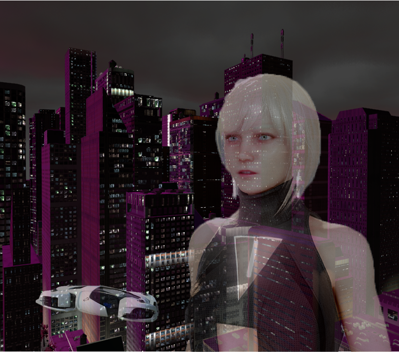

## Project Red Dwarf - BBM421 Project

Imagine a world where a handful of corporations own everything; your memories, your hopes, your dreams, your life. A world where everyone has a price except for a few. A world full of lies, deception and cruelty…

But you have a chance. A chance to start a fire that will end the tyranny of the corporations. 
That chance is Iris. 
She has information that shouldn’t get to the wrong hands, and she needs to run!

Saving her is your only hope for a better world.

It won’t be easy and it won’t be without sacrifice; 
but someone needs to say enough, and that is YOU.
----
**Click the image below to watch the 4K Trailer**
----

----
**Click the image below to watch the gameplay devblog video**
----

